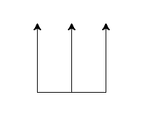

In the `past exercises`_ we have seen how to interact with turtle.

.. _past exercises: http://opentechschool.github.com/python-beginners/en/index.html

Sadly, we've been limited to one single, pre-defined turtle.  Wouldn't it be
great if we could have many of them, or change their very core behaviour?

Background
==========

When you learned how to draw shapes with turtle, we hid an important fact from
your view:  In Python, **everything is an object.**  Objects are instances of
classes.

Let me illustrate:  There is the class of cars --- that is, the concept behind
a car, ie. it has four tires, a motor, it can go forward, backward, you can
refuel it, etc.  Then that car in your garage (bear with us if you don't have a
garage, or a car for that matter) --- that's one specific instance of the class
of cars.  Programmers would also call this an "object."

Indeed even the ``turtle.forward()`` commands we have issued previously
operated on an object behind the scenes.

Creating more turtles
=====================

In the turtle module, there is a class called ``Turtle``::

  from turtle import Turtle

.. note::

   Wondering about that ``from ... import ...`` syntax?  It means that we want
   to import parts from a module selectively.  If we knew beforehand our turtle
   applications only ever had to user the forward and right motions, we could
   do the following::

     from turtle import forward, right

     forward(50)
     right(90)

   That saved us writing ``turtle.`` in front of every command.

We can now make a new turtle by creating an instance of ``Turtle``::

  my_turtle = Turtle()

This acts like the ``turtle`` we experimented with in earlier exercices::

  my_turtle.forward(50)

Exercise
--------

Can you create three turtles so that they cooperate to draw the following
shape?

Solution
--------

::

    import turtle

    a = turtle.Turtle()
    a.forward(50)
    a.left(90)
    a.forward(100)

    b = turtle.Turtle()
    b.left(90)
    b.forward(100)

    c = turtle.Turtle()
    c.backward(50)
    c.left(90)
    c.forward(100)

::

    from turtle import Turtle

    a = Turtle()
    b = Turtle()
    c = Turtle()

    a.forward(50)
    c.backward(50)

    for turtle in a, b, c:
        turtle.left(90)
        turtle.forward(100)

Crossing the chasm
==================

Say we have a turtle program from our beginners workshop::

  import turtle

  turtle.forward(50)
  turtle.right(90)
  turtle.forward(100)
  turtle.right(90)
  turtle.forward(50)
  turtle.right(90)
  turtle.forward(100)
  turtle.right(90)

That turtle also belongs to the class of turtles, ie. ``Turtle``.  What are the
minimal changes to this program to make it clear that turtle is indeed an
object?

Solution
--------

::

  from turtle import Turtle
  turtle = Turtle()

  # rest remains unchanged
  turtle.forward(50)
  turtle.right(90)
  turtle.forward(100)
  turtle.right(90)
  turtle.forward(50)
  turtle.right(90)
  turtle.forward(100)
  turtle.right(90)

Colorful turtle
===============

Let's quickly revisit the cars example:  There is the class of cars; individual
cars are instances of that class.  In Python, we could model this as follows::

  class Car:
    pass
    
  my_car = Car()
  my_neighbours_car = Car()
  
We can also identify groups of cars which share common traits, for example all
trucks or all racing cars.  Such groups are called **subclasses** and can be
written like this::

  class Truck(Car):
    pass

  the_moving_companys_car = Truck()

Programmers would say that ``Car`` is the "superclass" or "parent class" of
``Truck``.

Subclasses can also modify the superclass' behaviour::

  class UnmovableTurtle(Turtle):

      def forward(self, distance):
          print ("I'm not moving!")

Constructors!

Exercise
--------

Solution
--------

::

  class RedTurtle(Turtle):
      def __init__(self):
          Turtle.__init__(self)
          self.color("red")

.. Let's ignore arguments to __init__ for now.

.. Unfortunately, setting _pencolor on Turtle is pointless:  It is
   unconditionally overwritten by _CFG["pencolor"] during __init__.

Mixins
======
